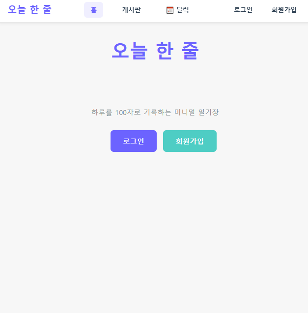
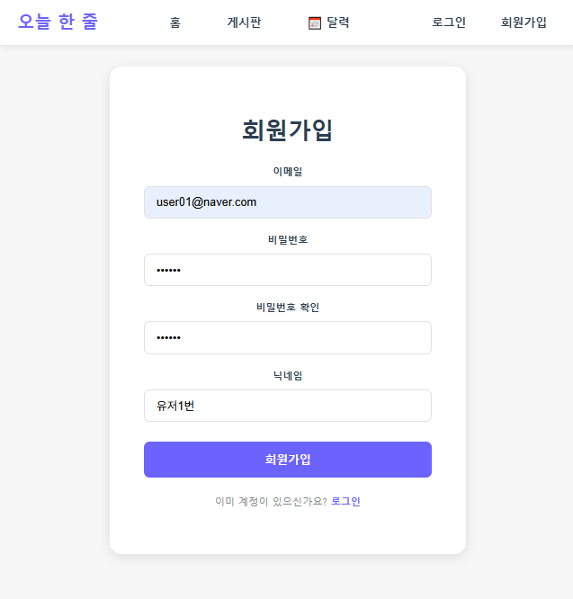
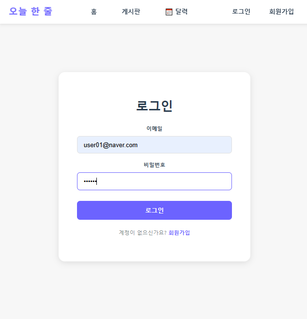
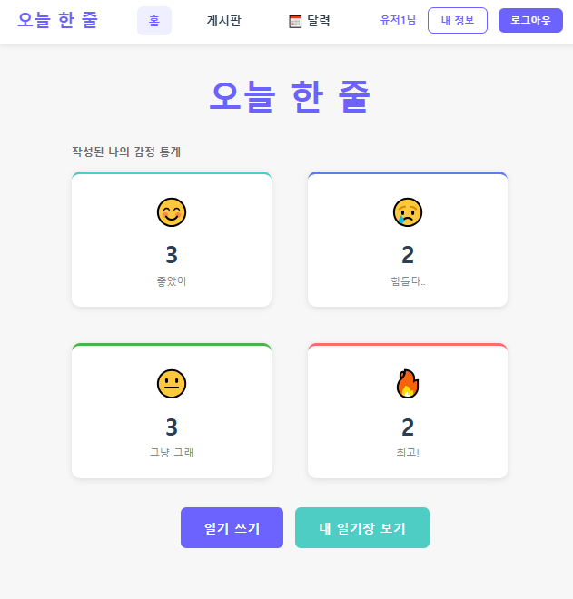
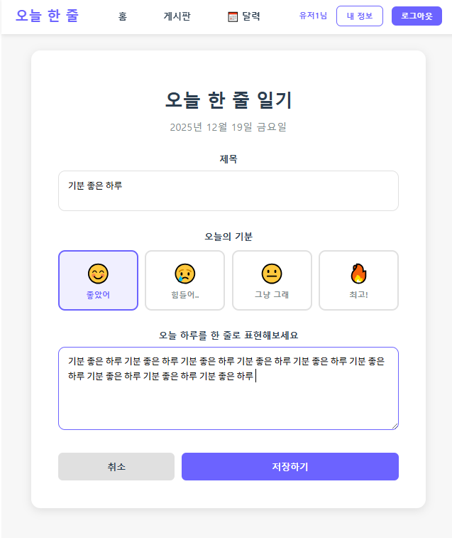
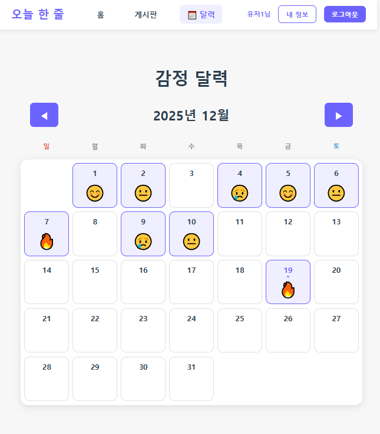
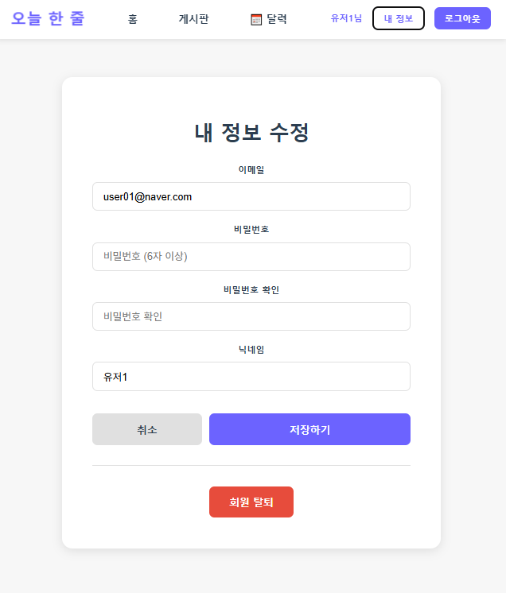

# 일기장 REST API 서버

이 프로젝트는 React 기반 일기장 애플리케이션에서 사용할
백엔드 REST API 서버입니다.

기존에 구현했던 Diary-Project-react 프로젝트를 기반으로,
프론트엔드에서 사용하던 기능들을 REST API 구조로 재설계하고 분리하는 것을 목표로 합니다.

React 클라이언트와의 연동을 고려하여
회원 관리, 일기 CRUD 기능 등을 API 형태로 제공하도록 구현되었습니다.


<sub>🔗 프론트엔드 프로젝트:
https://github.com/Hyeokjina/Diary-Project-react
</sub>

---

## 프론트엔드와의 주요 차이점

기존 Diary-Project-react와 비교하여 다음과 같은 변경사항이 있습니다:

### 1. 아키텍처 분리
- **기존**: 프론트엔드에서 Zustand를 사용한 클라이언트 상태 관리 (Mock 데이터)
- **현재**: 백엔드 REST API 서버로 분리, 실제 데이터베이스(H2) 사용

### 2. 감정(Emotion) 데이터 구조 변경
- **기존**: 프론트엔드에서 5개 감정 사용 (좋았어, 힘들어, 화나, 설레, 차분)
- **현재**: 백엔드 DB에서 4개 감정으로 통일 (happy: 좋았어, sad: 힘들어.., normal: 그냥 그래, fire: 최고!)
- 프론트엔드도 4개 감정에 맞춰 수정 필요

### 3. API 응답 구조 표준화
- **기존**: 프론트엔드 함수가 직접 데이터 반환
- **현재**: 모든 단일 리소스 API가 `ApiResponse` 형식으로 통일
  ```json
  {
    "success": true/false,
    "message": "성공/실패 메시지",
    "data": { 실제 데이터 또는 null }
  }
  ```
- 목록 조회 API(`GET /api/diaries`, `GET /api/diaries/member/{memberId}`)는 배열 직접 반환

### 4. 일기 목록 응답 최적화
- **기존**: 모든 필드 포함
- **현재**: 목록 조회 시 `content`와 `updatedAt` 필드는 `null`로 반환하여 응답 크기 최적화
- 상세 조회 시에만 전체 필드 제공

### 5. 달력(Calendar) 기능 데이터 처리
- **기존**: 프론트엔드에서 Mock 데이터로 달력 표시
- **현재**: 백엔드 API에서 실제 작성일(`createdAt`) 기반으로 데이터 제공
- 프론트엔드는 `GET /api/diaries/member/{memberId}`로 해당 회원의 모든 일기를 가져와 날짜별로 필터링하여 달력에 표시

### 6. 회원 관리 기능 확장
- **기존**: 회원가입, 로그인만 구현
- **현재**: 회원 정보 조회(`GET /api/members/{id}`), 수정(`PUT /api/members/{id}`), 탈퇴(`DELETE /api/members/{id}`) 추가

### 7. 데이터 영속성
- **기존**: 브라우저 새로고침 시 데이터 초기화
- **현재**: H2 파일 기반 DB 사용으로 서버 재시작 후에도 데이터 유지

---

## 주요 화면

### 홈 & 인증
| 비로그인 홈 | 회원가입 | 로그인 |
|----------|--------|--------|
|  |  |  |

### 일기 기능
| 로그인 후 홈 | 일기 작성 | 일기 목록 |
|----------|--------|--------|
|  |  |  |

### 일기 관리 & 회원 정보
| 일기 상세/수정/삭제 | 달력 | 내 정보 |
|----------|--------|--------|
|  |  |  |

---

## 프로젝트 개요

이 프로젝트는 일기장 기능을 제공하는 RESTful API 서버로, 회원가입/로그인, 일기 CRUD 기능을 제공합니다.

## 사용 기술 스택

- **Java 17**
- **Spring Boot 3.x**
- **Spring Data JPA** + **Hibernate**
- **H2 Database** (인메모리 데이터베이스)
- **Gradle**
- **Lombok**

## 주요 도메인

### Member (회원)
- 회원 정보 관리
- 회원가입 및 로그인 기능
- 일기와 1:N 관계

### Diary (일기)
- 일기 작성, 조회, 수정, 삭제
- 회원별 일기 조회
- Member와 N:1 관계
- Emotion과 N:1 관계

### Emotion (감정)
- 감정 정보 관리 (happy, sad, normal, fire)
- 일기와 1:N 관계
- 초기 데이터로 4개 감정 제공 (좋았어, 힘들어.., 그냥 그래, 최고!)

## API 명세

### 1. 회원 API

#### 1.1 회원가입
- **URL**: `POST /api/members/signup`
- **Request Body**:
```json
{
  "email": "user@example.com",
  "password": "password123",
  "nickname": "홍길동"
}
```
- **Response**:
  - **201 Created**: 회원가입 성공
  - **409 Conflict**: 이메일 중복
- **Response Body** (성공 시):
```json
{
  "success": true,
  "message": "회원가입 성공",
  "data": null
}
```

#### 1.2 로그인
- **URL**: `POST /api/members/login`
- **Request Body**:
```json
{
  "email": "user@example.com",
  "password": "password123"
}
```
- **Response**:
  - **200 OK**: 로그인 성공
  - **400 Bad Request**: 이메일 또는 비밀번호 오류
- **Response Body** (성공 시):
```json
{
  "success": true,
  "message": "로그인 성공",
  "data": {
    "id": 1,
    "email": "user@example.com",
    "nickname": "홍길동",
    "createdAt": "2025-12-15T10:30:00"
  }
}
```

#### 1.3 회원 정보 조회
- **URL**: `GET /api/members/{id}`
- **Path Variable**: `id` (Long)
- **Response**:
  - **200 OK**: 조회 성공
  - **404 Not Found**: 회원을 찾을 수 없음
- **Response Body** (성공 시):
```json
{
  "success": true,
  "message": "회원 조회 성공",
  "data": {
    "id": 1,
    "email": "user@example.com",
    "nickname": "홍길동",
    "createdAt": "2025-12-15T10:30:00"
  }
}
```

#### 1.4 회원 정보 수정
- **URL**: `PUT /api/members/{id}`
- **Path Variable**: `id` (Long)
- **Request Body**:
```json
{
  "email": "newemail@example.com",
  "password": "newpassword123",
  "nickname": "새닉네임"
}
```
- **Response**:
  - **200 OK**: 수정 성공
  - **404 Not Found**: 회원을 찾을 수 없음
  - **409 Conflict**: 이메일 중복
- **Response Body** (성공 시):
```json
{
  "success": true,
  "message": "회원정보 수정 성공",
  "data": {
    "id": 1,
    "email": "newemail@example.com",
    "nickname": "새닉네임",
    "createdAt": "2025-12-15T10:30:00"
  }
}
```

#### 1.5 회원 탈퇴
- **URL**: `DELETE /api/members/{id}`
- **Path Variable**: `id` (Long)
- **Response**:
  - **200 OK**: 탈퇴 성공
  - **404 Not Found**: 회원을 찾을 수 없음
- **Response Body** (성공 시):
```json
{
  "success": true,
  "message": "회원 탈퇴 성공",
  "data": null
}
```

---

### 2. 일기 API

#### 2.1 전체 일기 목록 조회
- **URL**: `GET /api/diaries`
- **Response**:
  - **200 OK**: 조회 성공
- **Response Body**:
```json
[
  {
    "id": 1,
    "memberId": 1,
    "title": "오늘의 일기",
    "content": null,
    "emotion": "happy",
    "createdAt": "2025-12-15T10:30:00",
    "updatedAt": null
  },
  {
    "id": 2,
    "memberId": 1,
    "title": "즐거운 하루",
    "content": null,
    "emotion": "fire",
    "createdAt": "2025-12-14T09:20:00",
    "updatedAt": null
  }
]
```

#### 2.2 회원별 일기 목록 조회
- **URL**: `GET /api/diaries/member/{memberId}`
- **Path Variable**: `memberId` (Long)
- **Response**:
  - **200 OK**: 조회 성공
- **Response Body**:
```json
[
  {
    "id": 1,
    "memberId": 1,
    "title": "오늘의 일기",
    "content": null,
    "emotion": "happy",
    "createdAt": "2025-12-15T10:30:00",
    "updatedAt": null
  }
]
```

#### 2.3 일기 상세 조회
- **URL**: `GET /api/diaries/{id}`
- **Path Variable**: `id` (Long)
- **Response**:
  - **200 OK**: 조회 성공
  - **404 Not Found**: 일기를 찾을 수 없음
- **Response Body** (성공 시):
```json
{
  "success": true,
  "message": "일기 조회 성공",
  "data": {
    "id": 1,
    "memberId": 1,
    "title": "오늘의 일기",
    "content": "오늘은 정말 좋은 하루였다. 새로운 것을 배웠고...",
    "emotion": "happy",
    "createdAt": "2025-12-15T10:30:00",
    "updatedAt": "2025-12-15T10:30:00"
  }
}
```

#### 2.4 일기 작성
- **URL**: `POST /api/diaries`
- **Request Body**:
```json
{
  "memberId": 1,
  "title": "오늘의 일기",
  "content": "오늘은 정말 좋은 하루였다.",
  "emotion": "happy"
}
```
- **Response**:
  - **201 Created**: 작성 성공
  - **400 Bad Request**: 잘못된 요청 (존재하지 않는 회원 또는 감정)
- **Response Body** (성공 시):
```json
{
  "success": true,
  "message": "일기 작성 성공",
  "data": null
}
```

#### 2.5 일기 수정
- **URL**: `PUT /api/diaries/{id}`
- **Path Variable**: `id` (Long)
- **Request Body**:
```json
{
  "title": "수정된 일기 제목",
  "content": "수정된 내용입니다.",
  "emotion": "sad"
}
```
- **Response**:
  - **200 OK**: 수정 성공
  - **404 Not Found**: 일기를 찾을 수 없음
  - **400 Bad Request**: 잘못된 요청
- **Response Body** (성공 시):
```json
{
  "success": true,
  "message": "일기 수정 성공",
  "data": null
}
```

#### 2.6 일기 삭제
- **URL**: `DELETE /api/diaries/{id}`
- **Path Variable**: `id` (Long)
- **Response**:
  - **200 OK**: 삭제 성공
  - **404 Not Found**: 일기를 찾을 수 없음
- **Response Body** (성공 시):
```json
{
  "success": true,
  "message": "일기 삭제 성공",
  "data": null
}
```

---

## HTTP 상태 코드 정리

| 상태 코드 | 설명 | 사용 예시 |
|---------|------|---------|
| 200 OK | 요청 성공 | 조회, 수정, 삭제 성공 |
| 201 Created | 리소스 생성 성공 | 회원가입, 일기 작성 성공 |
| 400 Bad Request | 잘못된 요청 | 유효성 검증 실패, 로그인 실패 |
| 404 Not Found | 리소스 없음 | 존재하지 않는 일기 조회 |
| 409 Conflict | 리소스 충돌 | 이메일 중복 |
| 500 Internal Server Error | 서버 오류 | 서버 내부 오류 |

---

## 데이터베이스 스키마

### member 테이블
```sql
CREATE TABLE member (
    id BIGINT AUTO_INCREMENT PRIMARY KEY,
    email VARCHAR(100) NOT NULL UNIQUE,
    password VARCHAR(100) NOT NULL,
    nickname VARCHAR(50) NOT NULL,
    created_at TIMESTAMP NOT NULL,
    updated_at TIMESTAMP NOT NULL
);
```

### emotion 테이블
```sql
CREATE TABLE emotion (
    id BIGINT AUTO_INCREMENT PRIMARY KEY,
    name VARCHAR(20) NOT NULL UNIQUE,
    description VARCHAR(100)
);
```

### diary 테이블
```sql
CREATE TABLE diary (
    id BIGINT AUTO_INCREMENT PRIMARY KEY,
    member_id BIGINT NOT NULL,
    emotion_id BIGINT NOT NULL,
    title VARCHAR(200) NOT NULL,
    content VARCHAR(500) NOT NULL,
    created_at TIMESTAMP NOT NULL,
    updated_at TIMESTAMP NOT NULL,
    FOREIGN KEY (member_id) REFERENCES member(id) ON DELETE CASCADE,
    FOREIGN KEY (emotion_id) REFERENCES emotion(id)
);
```

---

## 실행 방법

### 백엔드 서버 실행

#### 1. 프로젝트 클론 및 빌드
```bash
git clone <repository-url>
cd diary-rest-jpa
./gradlew build
```

#### 2. 애플리케이션 실행
```bash
./gradlew bootRun
```

#### 3. 서버 접속 확인
- **API Server**: `http://localhost:8080`
- **H2 Console**: `http://localhost:8080/h2-console`
  - JDBC URL: `jdbc:h2:file:./data/diarydb` (파일 기반 DB)
  - Username: `sa`
  - Password: (없음)

### 프론트엔드(React) 서버 실행

#### 1. React 프로젝트 클론
```bash
git clone https://github.com/Hyeokjina/Diary-Project-react
cd Diary-Project-react
```

#### 2. 의존성 설치
```bash
npm install
```

#### 3. package.json에 proxy 설정 추가
```json
{
  "proxy": "http://localhost:8080"
}
```

#### 4. React 개발 서버 실행
```bash
npm start
```

#### 5. 브라우저 접속
- **React App**: `http://localhost:3000`

### 전체 실행 순서
1. 백엔드 서버 실행 (포트 8080)
2. React 서버 실행 (포트 3000)
3. 브라우저에서 `http://localhost:3000` 접속
4. React 앱이 백엔드 API(`http://localhost:8080/api/*`)와 통신

---

## React 연동 시 CORS 설정

개발 단계에서 React와 연동 시, React 프로젝트의 `package.json`에 다음 설정을 추가하세요:

```json
{
  "proxy": "http://localhost:8080"
}
```

이후 API 호출 시 상대 경로로 요청:
```javascript
// 예시
fetch("/api/diaries")
  .then(res => res.json())
  .then(data => console.log(data));
```

---
